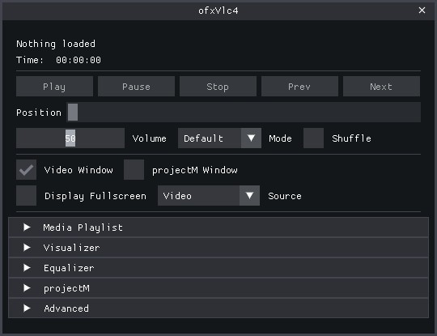

# ofxVlc4

`ofxVlc4` is an openFrameworks wrapper around `libVLC 4` with a texture-based video path, optional native-window backends on Windows, playlist helpers, transport controls, media discovery, diagnostics, recording helpers, MIDI utilities, and a large GUI example.

The main public header is:

- `src/ofxVlc4.h`

Bundled VLC help assets:

- `vlc-help.txt`
  - runtime-derived English `--help`, used for `Help`
- `vlc-full-help.txt`
  - runtime-derived English `--full-help`, used for `FullHelp`

It is aimed at media-player style apps, video-texture workflows, and hybrid tools where playback, analysis, overlays, and custom rendering need to live inside openFrameworks.



## Note

Parts of this addon, its examples, GUI structure, and documentation were developed with AI-assisted help during implementation and refinement.

## License

This addon is released under the [MIT License](LICENSE).

## Release

- addon release version: `1.1.0`
- changelog: `CHANGELOG.md`

## Highlights

- `libVLC 4` playback in openFrameworks
- texture-based video output for OF rendering and shader pipelines
- optional Windows backends:
  - native window output (`HWND`)
  - D3D11 HDR metadata path
- optional Windows decoder-hardware preference for `Auto`, `D3D11`, `DXVA2`, `NVDEC`, or `None`
- optional pre-init libVLC text-renderer settings for VLC-rendered subtitles
- playlist and playback helpers
- audio devices, audio output module selection, delays, EQ, mixmode
- video adjustments, deinterlace, crop, aspect, fit, overlays
- track, title, chapter, program, subtitle, and teletext control
- renderer/cast discovery and media discovery
- snapshots, thumbnails, native record, bookmarks
- texture recording helpers plus automatic current-window capture helpers
- watch-time, stats, logging, dialog callbacks, metadata editing
- optional high-level player-command dispatch for transport, disc navigation, and teletext color-key actions
- pre-init decoder hardware preference through `setPreferredDecoderDevice(...)`
- advanced pre-init override args through `setExtraInitArgs(...)`, `addExtraInitArg(...)`, or raw `init(argc, argv)` arguments
- MIDI analysis, bridge, and local transport helpers

## Source layout

The main public API stays in:

- `src/ofxVlc4.h`

Implementation is split by concern:

- `src/core/ofxVlc4.cpp`
- `src/audio/ofxVlc4Audio.cpp`
- `src/video/ofxVlc4Video.cpp`
- `src/media/ofxVlc4Media.cpp`
- `src/playback/ofxVlc4Playback.cpp`
- `src/support/ofxVlc4Utils.h`

Support classes:

- `src/recording/ofxVlc4Recorder.*`
- `src/support/ofxVlc4RingBuffer.*`
- `src/support/ofxVlc4MuxHelpers.h`
- `src/midi/ofxVlc4MidiAnalysis.*`
- `src/midi/ofxVlc4MidiBridge.*`
- `src/midi/ofxVlc4MidiPlayback.*`
- `src/core/ofxVlc4Types.h`
- `src/core/ofxVlc4Impl.h`
- `src/core/VlcCoreSession.*`
- `src/core/VlcEventRouter.*`
- `src/media/MediaLibrary.*`
- `src/media/MediaLibraryState.h`
- `src/playback/PlaybackController.*`
- `src/playback/PlaybackTransportState.h`

## Clone / install quick start

Clone the addon into your openFrameworks `addons` folder:

```bash
git clone https://github.com/Jonathhhan/ofxVlc4.git
```

Then install the bundled `libVLC` layout:

```bash
bash scripts/install-libvlc.sh
```

On Windows, that script now prepares each example directly for Project Generator users:

- `bin/libvlc.dll` and `bin/libvlccore.dll`
- `bin/plugins/`
- `bin/lua/`
- `dll/x64/` with only the root VLC DLLs for generated-project staging

The examples do not ship a bundled sample movie in `bin/data`. Drop your own media into an example's `bin/data`, drag a file in at runtime, or use the standard openFrameworks sample video from `examples/video/videoPlayerExample/bin/data/movies/fingers.mp4`.

## Installing libVLC

The addon ships with a single cross-platform shell entry point that installs `libVLC` headers/import libs into `libs/libvlc` and the shared Windows runtime into `runtime/vs/x64`.

If you want one shell entry point across supported environments, use:

```bash
bash scripts/install-libvlc.sh
```

The script dispatches to:

- macOS: native installer path for `VLC.app`
- Git Bash / MSYS / Cygwin / WSL on Windows: embedded PowerShell installer for the nightly ZIP
- native Linux: no local installer, use system `libvlc` packages via `pkg-config`

### Windows

Run:

```bash
bash scripts/install-libvlc.sh
```

This installs:

- headers into `libs/libvlc/include`
- import library into `libs/libvlc/lib/vs`
- one shared runtime into `runtime/vs/x64`
- linked file-tree runtime views into the example `bin` folders
- linked file-tree `dll/x64` staging folders for generated project workflows

For the Windows examples, the intended runtime layout in `bin` includes:

- `libvlc.dll` and `libvlccore.dll` in the `bin` root
- `plugins/` as a real subfolder
- `lua/` as a real subfolder

If you ever see all VLC plugin DLLs flattened directly into `bin`, that is a staging/build-layout problem rather than the intended release layout.

For normal addon development, keep the shared Windows runtime in `runtime/vs/x64` and let the examples link to it locally. Only copy the VLC runtime into your app output if you want a truly standalone distribution.

The installer works in a temporary directory outside the addon tree, which is helpful when the addon lives in a synced or otherwise path-sensitive folder.

### macOS

Run:

```bash
bash scripts/install-libvlc.sh
```

or point it at a specific app bundle:

```bash
bash scripts/install-libvlc.sh --vlc-app /Applications/VLC.app
```

This installs:

- headers into `libs/libvlc/include`
- `libvlc.dylib` and `libvlccore.dylib` into `libs/libvlc/lib/osx/lib`
- plugins into `libs/libvlc/lib/osx/plugins`
- runtime and plugins into each example's `bin/data/libvlc/macos` folder

For the staged macOS runtime, the installer also rewrites the copied VLC dylib IDs and dependency paths with `install_name_tool`, and the addon adds matching `@rpath` entries for:

- `@executable_path/../Resources/data/libvlc/macos/lib`
- `@executable_path/../data/libvlc/macos/lib`

At runtime the addon additionally exports `VLC_PLUGIN_PATH` to `data/libvlc/macos/plugins`, so both the loader path and plugin discovery path point at the staged example runtime.

The macOS path is meant for the default texture backend. The Windows-only `HWND` and `D3D11` output modes are not used on macOS.

### Linux / WSL

Run:

```bash
bash scripts/install-libvlc.sh
```

In WSL or Git Bash on Windows, this wrapper calls the Windows PowerShell installer. On native Linux it exits with a reminder to use system `libvlc` packages instead.

### Native Linux

Install VLC 4 and libVLC development packages through your package manager. On Linux the addon links through `pkg-config`.

## Example dependencies

The full example also depends on:

- `ofxProjectM`
- `ofxImGui` on its `develop` branch

Example:

```bash
git clone --branch develop https://github.com/jvcleave/ofxImGui.git
```

## Examples

- **`ofxVlc4QuickStart`** ⭐ **NEW - Start here!**
  - minimal single-file example in ~90 lines of code
  - perfect for learning basics and quick prototyping
  - drag-and-drop playback with simple controls
  - see [ofxVlc4QuickStart/README.md](ofxVlc4QuickStart/README.md)
- `ofxVlc4Example`
  - full GUI, previews, projectM integration, diagnostics, subtitle loading/track control, and an optional OF-drawn `.srt` overlay with selectable TTF fonts
  - includes a dedicated `DVD / Disc` control section for title/chapter/program navigation and menu buttons, while teletext lives under `Tracks & Subtitles`
  - example anaglyph shaders are now owned by the addon under `src/video/shaders` instead of the example `bin/data` tree
- `ofxVlc4360Example`
  - focused ImGui-based 360 / panoramic playback example with projection, stereo mode, live viewpoint controls, and lightweight playlist/folder drop support
  - includes a helper download script for free 360 sample media
- `ofxVlc4MidiExample`
  - smaller ImGui-based MIDI/media example with local MIDI transport, sync, export, and `ofxMidiOut` routing
  - expects the `ofxMidi` addon for device output
- `ofxVlc4RecorderExample`
  - focused recording example with an ImGui recorder panel, native record, session-based texture/window capture, muxing, and recorder readback metrics
  - includes recording presets for `H265 / HEVC`, `MKV / Opus`, and `MKV / LPCM`
  - `H265 / HEVC` recording currently requires one of the `MKV` mux profiles
  - `H265 / HEVC` recording normalizes capture sizes to the bundled x265 alignment before encoding (`width % 16 == 0`, `height % 8 == 0`)

For audio-visualization workflows, the addon treats `ofxProjectM` as the primary integrated path. Bundled VLC visualization plugins remain available through the staged runtime, but they should currently be treated as experimental libVLC runtime extras rather than as the main addon feature path.

For the examples, also see:

- [ofxVlc4QuickStart/README.md](ofxVlc4QuickStart/README.md) ⭐ **Start here for basics**
- [ofxVlc4Example/README.md](ofxVlc4Example/README.md)
- [ofxVlc4360Example/README.md](ofxVlc4360Example/README.md)
- [ofxVlc4MidiExample/README.md](ofxVlc4MidiExample/README.md)
- [ofxVlc4RecorderExample/README.md](ofxVlc4RecorderExample/README.md)

## Subsystem quick reference

- playlist
  - addon-owned queue/state API for UI, transport, and metadata-aware item access
  - see `Structured playlist API` below
- recorder
  - addon-owned session start/stop/finalize/mux flow for texture and window capture
  - see `Structured recorder API` below
- MIDI
  - addon-owned local MIDI transport, analysis, sync, and output callback routing
  - see `Structured MIDI API` below
- playback clock
  - high-resolution watch-time state/callbacks plus timecode formatting helpers
  - see `Structured playback clock API` below
- backend routing
  - `Texture` is the default OF-integrated path, while `NativeWindow / HWND` is where libVLC-native video filters/effects apply
  - see `Backend capability notes` below

**API Documentation**: For comprehensive API organization, usage patterns, and subsystem guides, see [docs/API_GUIDE.md](docs/API_GUIDE.md). To generate full API reference documentation with Doxygen, run `doxygen` in the repository root (output: `docs/api/html/index.html`).

**Migration Guide**: Transitioning from `ofVideoPlayer`? See [docs/MIGRATION_FROM_OFVIDEOPLAYER.md](docs/MIGRATION_FROM_OFVIDEOPLAYER.md) for a complete migration guide with API mapping and code examples.

**Contributing**: Interested in contributing? See [CONTRIBUTING.md](CONTRIBUTING.md) for development workflow, code standards, and testing guidelines.

**Simplified APIs**: For simpler use cases, check out the facade classes in `src/facade/`:
- `ofxVlc4SimplePlayer` - Essential playback methods (~15 methods vs ~400)
- `ofxVlc4SimpleRecorder` - Easy recording with quality presets
- See `src/facade/README.md` for examples

## Minimal API

For the stable texture-based workflow, the recommended order is:

```cpp
ofxVlc4 player;

void ofApp::setup() {
    player.setAudioCaptureEnabled(true);   // optional, before init()
    player.init(0, nullptr);
    player.setWatchTimeEnabled(true);      // optional, recommended for UI/transport
    player.setWatchTimeMinPeriodUs(50000); // optional

    player.addPathToPlaylist(ofToDataPath("movie.mp4", true));
    player.playIndex(0);
}

void ofApp::update() {
    player.update();
}

void ofApp::draw() {
    player.draw(0, 0, ofGetWidth(), ofGetHeight());
}

void ofApp::exit() {
    player.close();
}
```

For advanced libVLC startup overrides, the addon now supports both typed pre-init settings and raw argument escape hatches:

- typed settings first:
  - `setPreferredDecoderDevice(...)`
  - `setSubtitleTextRenderer(...)`
  - `setSubtitleFontFamily(...)`
  - `setSubtitleTextColor(...)`
  - `setSubtitleTextOpacity(...)`
  - `setSubtitleBold(...)`
- raw `init(argc, argv)` arguments after the typed settings
- stored extra args last through:
  - `setExtraInitArgs(...)`
  - `addExtraInitArg(...)`
  - `clearExtraInitArgs()`

That ordering is intentional: typed settings stay discoverable and documented, while raw args remain available as an advanced override path when you need a libVLC option the addon does not model directly yet.

Useful state getters:

- `getMediaReadinessInfo()`
- `getPlaybackStateInfo()`
- `getAudioStateInfo()`
- `getVideoStateInfo()`
- `getWatchTimeInfo()`

Common controls:

- `play()`
- `pause()`
- `stop()`
- `nextMediaListItem()`
- `previousMediaListItem()`

Playlist helpers:

- `getPlaylistStateInfo()`
- `getPlaylistItems()`
- `getCurrentPlaylistItemInfo()`

External slave helpers:

- `getMediaSlaves()`
- `addMediaSlave(type, uri, priority)`
- `addSubtitleSlave(uri, priority)`
- `addAudioSlave(uri, priority)`
- `clearMediaSlaves()`
- `getPlaylist()`

Structured playlist API:

- `getPlaylistStateInfo()`
  - coarse playlist state for UI and transport gating
  - includes `items`, `currentIndex`, `hasCurrent`, `size`, `empty`
- `getPlaylistItems()`
  - full item list with addon-owned labels and flags
- `getCurrentPlaylistItemInfo()`
  - convenience getter for the current playlist item without separate index lookups
- `getPlaylist()`
  - compatibility/raw path list, still available when older code wants the original vector shape

Recorder helpers:

- `recordVideo(...)`
- `recordAudio(...)`
- `recordAudioVideo(...)`
- `beginWindowRecording(...)`
- `endWindowRecording()`
- `startRecordingSession(...)`
- `startTextureRecordingSession(...)`
- `startWindowRecordingSession(...)`
- `stopRecordingSession()`
- `getRecordingSessionState()`
- `getRecordingPreset()`
- `setRecordingPreset(...)`
- `setPosition(...)`
- `setVolume(...)`
- `toggleMute()`

Structured recorder API:

- `startRecordingSession(...)`
  - addon-owned session start for texture/window recording, audio source, and mux-on-stop behavior
- `startTextureRecordingSession(...)` / `startWindowRecordingSession(...)`
  - convenience entry points for the two common capture sources
- `stopRecordingSession()`
  - unified stop path that drives capture stop, finalize, and any configured post-stop mux
- `getRecordingSessionState()`
  - coarse recorder lifecycle state for UI and shutdown handling
- `getRecordingPreset()` / `setRecordingPreset(...)`
  - codec, mux, size, FPS, bitrate, and cleanup defaults carried as one addon preset object
- legacy `recordVideo(...)` / `recordAudio(...)` / `recordAudioVideo(...)`
  - still available for direct/manual workflows, but the session API is the cleaner path for new code

Structured MIDI API:

- `loadMidiFile(...)`
  - load a local MIDI file into the addon's transport and analysis path
- `playMidi()` / `pauseMidi()` / `stopMidi()` / `seekMidi(...)`
  - addon-owned local MIDI transport controls
- `getMidiTransportInfo()`
  - coarse transport state for UI and routing decisions
- `setMidiMessageCallback(...)`
  - addon-owned dispatch callback for MIDI output, including normal channel voice messages and SysEx
- `setMidiSyncSettings(...)`
  - configure MIDI Clock / MTC quarter-frame behavior
- `setMidiSyncSource(...)` / `setMidiSyncToWatchTimeEnabled(...)`
  - couple MIDI transport timing to local playback transport and optional libVLC watch-time updates
- `getMidiAnalysisReport()`
  - structured MIDI analysis/report surface for UI and export

Structured playback clock API:

- `setWatchTimeEnabled(...)` / `setWatchTimeMinPeriodUs(...)`
  - enable libVLC watch-time updates and choose the callback cadence
- `getWatchTimeInfo()`
  - latest high-resolution playback clock state for UI, sync, and transport logic
- `setWatchTimeCallback(...)`
  - optional callback surface for apps that want push-style timing updates
- `formatCurrentPlaybackTimecode()` / `formatPlaybackTimecode(...)`
  - helper formatting for `HH:MM:SS:FF`-style display using the current playback FPS when available
- `getPlaybackClockFramesPerSecond()`
  - current FPS estimate used for timecode-style formatting

Useful newer API groups:

- addon version
  - `getAddonVersionInfo()`
- startup/readiness
  - `getMediaReadinessInfo()`
  - `getPlaybackStateInfo()`
  - `getVideoStateInfo()`
  - audio/video state snapshots
    - `getAudioStateInfo()`
    - `getVideoStateInfo()`
    - `getRendererStateInfo()`
    - `getSubtitleStateInfo()`
    - `getNavigationStateInfo()`
- subtitle rendering
    - subtitle tracks can be selected and displayed inside the OF app through libVLC's subtitle renderer
    - external subtitle/audio attachments can be added through `addSubtitleSlave(...)`, `addAudioSlave(...)`, or the generic `addMediaSlave(...)`
    - VLC-rendered subtitle styling can be configured before init through `setSubtitleTextRenderer(...)`, `setSubtitleFontFamily(...)`, `setSubtitleTextColor(...)`, `setSubtitleTextOpacity(...)`, and `setSubtitleBold(...)`
    - `ofxVlc4Example` also includes an optional `.srt` parser + OF overlay path when you want subtitle strings rendered with OF fonts instead of VLC's own subtitle renderer
- texture workflow
    - `getTexture()`
    - `getRenderTexture()`
- diagnostics/timing
  - `getWatchTimeInfo()`
  - `getMediaStats()`
  - `getLibVlcLogEntries()`

## Recommended projectM assets

For the `ofxProjectM`-powered parts of the full example, these packs are recommended:

- [presets-cream-of-the-crop](https://github.com/projectM-visualizer/presets-cream-of-the-crop)
- [presets-milkdrop-texture-pack](https://github.com/projectM-visualizer/presets-milkdrop-texture-pack)

Download them with:

```bash
bash ofxVlc4Example/scripts/download-projectm-assets.sh
```

Place them like this:

- presets from `presets-cream-of-the-crop` go in the `presets` folder
- textures from `presets-milkdrop-texture-pack` go in the `textures` folder

## Notes

- The default path is still the OF texture backend.
- The recent internal source split does not require `addon_config.mk` changes because openFrameworks auto-scans `src`.

## Backend capability notes

- `Texture`
  - default and most integrated addon path
  - best fit for OF drawing, custom shaders, recorder texture capture, and safer real-time adjustments
  - libVLC video-filter chains are intentionally not pushed live on this backend
- `NativeWindow / HWND`
  - Windows-only alternate output path
  - best fit for libVLC-native video filters/effects and other vout-driven behavior
  - less integrated with OF texture/shader workflows
- `D3D11 / HDR metadata`
  - Windows-only specialist path for HDR/output experimentation
  - not the normal addon workflow and best treated as an advanced backend

## Known limits

- libVLC-native video-filter chains are intentionally disabled on the `Texture` backend because that path has been crash-prone in practice
- the safest real-time video-adjustment path is still the addon fallback on `Texture`; libVLC-native live effect changes belong on `NativeWindow / HWND`
- recorder workflows are stable, but they are still the most timing-sensitive subsystem and benefit from real app-level testing when you change size, FPS, codec, mux profile, or backend
- Windows-specific alternate backends like `NativeWindow / HWND` and `D3D11` are feature paths, not the addon's default portability story

## Critical paths

- playback-time diagnostics, timecode/FPS formatting, and track refreshes are the most sensitive live-query paths during active playback; the addon now prefers cached state there instead of probing libVLC aggressively every frame
- recorder shutdown and capture cleanup are still worth treating carefully because they combine libVLC teardown, texture ownership, and GL context lifetime
- `ofxVlc4360Example` now keeps the simpler `Sphere` path as the default and leaves `libVLC 360` available as the reference/native path

## Startup State Model

For startup-sensitive apps, the addon now distinguishes a few early playback phases instead of treating them as the same thing:

- `media attached`
  - a media object is already bound to the player
- `startup prepared`
  - startup-side audio/video/playback state has been prewarmed after media attach
- `geometry known`
  - source/render dimensions are already known, even if no displayed frame has arrived yet
- `frame received`
  - the first real video frame has reached the render callback path
- `playback active`
  - the player is currently reported as playing

For convenience getters, use:

- `getMediaReadinessInfo()`
- `getVideoStateInfo()`
- `getPlaybackStateInfo()`

This is especially useful for preview windows, FBO allocation, projectM/video-texture workflows, and startup diagnostics.

For texture workflows, there are now two paths:

- `getTexture()`
  - returns the addon-managed exposed texture copy
- `getRenderTexture()`
  - returns the direct internal render texture for workflows that can consume it without the extra exposed-texture copy

In `ofxVlc4Example`, a small hidden startup overlay can be toggled with `F9` to show:

- attached
- prepared
- geometry
- frame
- playing

## Workflow Notes

The current recommended workflow is intentionally conservative around libVLC callback threads:

- heavy track/title/program/subtitle refreshes should not run directly inside libVLC media-player event callbacks
- media/player settings are safest when applied on init, on media attach, or from normal app/update code
- audio callback `format/rate/channels` are configured through the fixed `libvlc_audio_set_format(...)` path
- the texture path is the default and best-tested route

In practice:

- configure capture/watch-time/options before `init()` when possible
- call `update()` every frame
- use readiness/state getters from app/UI code
- avoid pushing complex app logic into callback threads
- prefer the texture path first, then add alternate backends only when needed

That keeps startup, playback transitions, and shutdown much more predictable than pushing more logic into the callback thread.

## Recorder Notes

The addon recorder is still built around libVLC media callbacks, and the current path still performs GPU readback plus CPU-side frame copies before libVLC consumes the data. In practice, the recorder-side performance wins come from reducing stalls and backlog on the addon side rather than expecting the transport itself to become zero-copy.

Current recorder-side optimizations include:

- synchronous GL readback to keep the rawvid callback fed with a CPU-ready frame (async PBO path is disabled after starvation issues)
- recorder performance counters for pending frames, latency, drops, and map failures

Readback policy/buffer knobs remain in the API, but they are no-ops while the async PBO path is disabled.

For a focused surface to test that behavior, use `ofxVlc4RecorderExample`.

**Performance Guide**: For detailed performance characteristics, optimization strategies, and configuration recommendations for different recording scenarios (720p, 1080p, 4K, real-time streaming, archival, etc.), see [docs/RECORDING_PERFORMANCE.md](docs/RECORDING_PERFORMANCE.md).

## Tests

The addon ships a CMake-based unit-test suite in `tests/`. The tests compile without a real openFrameworks, GLFW, or VLC installation — stubs in `tests/stubs/` and `tests/stubs_gl/` supply the minimal type definitions required.

Thirty-two test binaries are built:

- `test_ringbuffer`
- `test_audio_pipeline`
- `test_midi_analysis`
- `test_utils`
- `test_mux_helpers`
- `test_playlist`
- `test_gl`
- `test_gl_ops`
- `test_midi_bridge`
- `test_midi_playback`
- `test_types`
- `test_midi_report`
- `test_audio_helpers`
- `test_video_helpers`
- `test_media_helpers`
- `test_recording_helpers`
- `test_media_library_helpers`
- `test_playlist_helpers`
- `test_video_pipeline`
- `test_video_output_reinit`
- `test_nle_timecode`
- `test_nle_sequence`
- `test_nle_edit_ops`
- `test_nle_trim_ops`
- `test_nle_edl_export`
- `test_nle_undo`
- `test_crash_handler`
- `test_callback_drain`
- `test_concurrent_shutdown`
- `test_gl_context_loss`
- `test_ringbuffer_overflow`
- `test_mux_join_timeout`

To build and run all unit tests:

```bash
mkdir -p /tmp/test-build
cd /tmp/test-build
cmake /path/to/ofxVlc4/tests
make
ctest
```

**Integration Tests**: Optional tests with real VLC runtime. See `tests/integration/README.md`.

**Performance Benchmarks**: Measure playback, recording, and memory performance. See `tests/benchmarks/README.md`.
